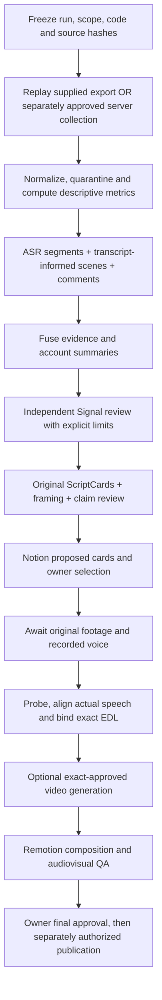

# M2 Signal + Studio · 7 September · ten-card release

- Notion URL: https://app.notion.com/p/3d20bd21ed6a813a9a4cd8f51a28af71?pvs=204
- Page path: AI Startup Workspace / Content Engine Tool
- Last edited: 2026-09-07T22:27:38.747Z

---

Here is the result of "fetch" for the Page with URL https://app.notion.com/p/3d20bd21ed6a813a9a4cd8f51a28af71 as of 2026-09-08T14:21:22.732Z:
<page url="https://app.notion.com/p/3d20bd21ed6a813a9a4cd8f51a28af71">
<ancestor-path>
<parent-page url="https://app.notion.com/p/3d00bd21ed6a800fb0ffda652e539ef1" title="Content Engine Tool"/>
<ancestor-2-page url="https://app.notion.com/p/8b46efbe31a44dab8f6ebd1cc54fc518" title="AI Startup Workspace"/>
</ancestor-path>
<properties>
{"title":"M2 Signal + Studio · 7 September · ten-card release"}
</properties>
<iconMetadata>null</iconMetadata>
<content>
## What the research means for M2 · 8 September
**The deliverable is ten original, one-minute shooting plans:** five introductions and five regular posts. Each teaches one practical decision about using AI in a small business. Seven combine several references into a new idea; all use original examples and planned visuals.
### The editorial conclusion
The strongest direction for this slate is to show a small, recognisable failure and let the viewer see how to handle it: an invented delivery date, an unclear appointment reply, or a missing stock item. These examples make M2’s positioning concrete: help a team decide where AI fits, what a person must check, and how to run a first test.
That is an editorial conclusion from the selected material, not a claim that we measured a winning formula. We used the reference transcripts to understand the argument and the sampled frames to inspect how it was explained. The creator handbook supplied secondary writing techniques; it did not replace the project evidence.
### Which cards to start with
**For the profile:** start with “Who agreed to Friday?” It introduces M2 through a visible gap between a source fact and a customer promise. Use “Start with the Friday update” to explain the broader method.
**For regular publication:** start with “The appointment reply your workflow forgot.” Its uncertain reply creates one clear problem, and the branch drawing supplies an answer a viewer can apply. “Add a failure column” is a complementary synthesis about choosing tools by the work of checking and correcting them.
This ordering is an editorial recommendation to test, not a forecast of reach.
<mention-database url="https://app.notion.com/p/225e60a931984e3ca151b462d20d2e63">Cards · 10 reviewed shooting plans · 7 September</mention-database>
### What is covered
- **2,352 Reels, 100 named accounts:** the complete backend dataset. Two Reels sit in an explicit unknown-account bucket.
- **1,062 non-empty machine transcripts — 45.2% of Reels:** 954 standard observations and 108 with suspicious timing. No new transcription was collected for this review.
- **1,194 frame sets; 19,808 extracted images:** extraction coverage, not a claim that every image was interpreted.
- **18 selected Reels from 15 accounts:** full-text and sampled-visual review used for the cards; 262 contact-sheet samples and 64 timestamped observations. The other 1,044 transcripts have lexical analysis, not the same depth of editorial review.
- **10 scripts, 70 planned scenes, 1,317 spoken words:** ten original illustrated sheets, each containing seven scene panels. These are shooting guides, not finished footage.
### How the comparisons informed the scripts
We inspected relevant subjects and explanatory structures, then considered views relative to the creator’s own eligible median. The wider comparison cohort contains 962 eligible English Reels across 85 accounts. Each card shows its references, dated views, creator-relative ratio, baseline size, and the specific idea taken from the analysis.
A high ratio helps identify a post worth inspecting. It cannot establish that the hook caused the result: capture dates, unequal exposure time, audience size, and selection all limit that conclusion. The metrics are a September 1 snapshot, not a live trend ranking.
### How to read the workspace
**Cards:** audience and pain → useful takeaway → complete spoken script → illustrated seven-scene plan → demonstration inputs and checks → reference reasoning → filming notes.
**Reels:** dated metrics and topical fields → original machine transcript → reviewed source images and timestamped observations. The focused reference view shows the 18 deeply reviewed examples; the complete CSV retains all 2,352 records.
**Accounts:** creator-level comparison and coverage → selected Reel examples with source images. The focused reference view contains 15 accounts. Full exports, field definitions, and graphs remain on both analysis pages.
<mention-page url="https://app.notion.com/p/3d40bd21ed6a815fb36dfd90d434cbed">Reels · transcripts, references and analysis · 7 September</mention-page>
<mention-page url="https://app.notion.com/p/3d40bd21ed6a8181b2f6eab949f95409">Accounts · coverage and comparison · 7 September</mention-page>
<mention-page url="https://app.notion.com/p/3d40bd21ed6a81749d94c0e9f6478590">Writing knowledge · source analysis and secondary creator techniques</mention-page>
### What works, and what remains
The portable package passes 14 local checks, including editorial integrity and pipeline tests. Local replay remains provider-disabled. The ten demonstrations are authored fictional examples; they are not recorded model results. Owner recording, real speech timing, final editing, publication, and partner-server provider execution remain separate steps.
Three previously reported transcript write exceptions remain outside these selected references: two missing text projections and one formatting mismatch. They do not change the ten scripts’ reference basis.
## Earlier evidence and technical audit trail
The checkpoints below preserve the execution history. Use the current summary and cards above for editorial decisions.
## Reviewed descriptive dataset · 7 September 2026
M2-CONTINUATION-20260907-0011
This checkpoint joins all 2,352 Reel identities with dated metrics and processing evidence. It contains 100 named accounts plus one unknown-account bucket with two Reel rows. Metrics are from September 1; processing is through event 7,633 on September 7. This is not new acquisition or a winner ranking.
Retained videos: 1,201. Nonempty machine transcripts: 1,062 (954 normal, 108 timing flagged). ASR failures: 108; empty/unverified: 24; not attempted: 1,158. Frame sets: 1,194. Restricted structural review: 34 across 20 accounts, including 12 entirely unclear structures. Acoustic accuracy and full semantic-scene coverage remain unverified.
The five CSV parts contain 489 + 496 + 536 + 593 + 238 = 2,352 rows. Combine data rows once and retain one header. The account CSV has 101 buckets; the unknown bucket is not a named account. Blank metrics remain missing. The dictionary defines the 48 Reel and nine account export fields. These attachments are a newer descriptive export; existing database rows and selected views have not yet been reconciled to this checkpoint.
The new source inventory verified the hashes and nonempty text of all 1,062 primary machine transcripts. This is a preparation step, not full semantic analysis. The supplied creator-techniques handbook has been registered as secondary reference. The requested five introduction cards and five regular cards, each group including a multi-source synthesis, remain in preparation; no ten-card release or final video delivery is claimed.
Reviewed infrastructure commit 73ed2f22c7b920e157992d9c009246021f12984e is pushed and read back on fork main and partner Latest; partner main is unchanged. Forty-six focused code tests passed. One local Remotion previsualization was rendered; owner footage and final audiovisual review remain pending.
### Complete descriptive exports and dashboard
<file src="file://%7B%22source%22%3A%22attachment%3A9961160f-fa4e-45ad-bf78-22ea9e2206be%3Am2-joined-0011-part-1.csv%22%2C%22permissionRecord%22%3A%7B%22table%22%3A%22block%22%2C%22id%22%3A%22f0bff415-513b-44fe-b9d7-f7338a529784%22%2C%22spaceId%22%3A%2289e0bd21-ed6a-81d8-b6e8-0003e21b0a2d%22%7D%7D"></file>
<file src="file://%7B%22source%22%3A%22attachment%3Ac6736c95-c1bb-448a-82b8-f9b9ee18c380%3Am2-joined-0011-part-2.csv%22%2C%22permissionRecord%22%3A%7B%22table%22%3A%22block%22%2C%22id%22%3A%22771ebd2d-a240-4c9c-a862-59b329e8dbd3%22%2C%22spaceId%22%3A%2289e0bd21-ed6a-81d8-b6e8-0003e21b0a2d%22%7D%7D"></file>
<file src="file://%7B%22source%22%3A%22attachment%3A72bedad1-95f7-47c3-900b-89e0b9e7677a%3Am2-joined-0011-part-3.csv%22%2C%22permissionRecord%22%3A%7B%22table%22%3A%22block%22%2C%22id%22%3A%22b0871f71-7869-4949-ac11-19ed538c9fdf%22%2C%22spaceId%22%3A%2289e0bd21-ed6a-81d8-b6e8-0003e21b0a2d%22%7D%7D"></file>
<file src="file://%7B%22source%22%3A%22attachment%3A5cdd295b-543c-4c61-96ed-a26782ec2b17%3Am2-joined-0011-part-4.csv%22%2C%22permissionRecord%22%3A%7B%22table%22%3A%22block%22%2C%22id%22%3A%22cb27f25e-59ac-49fc-9ca1-48b3c0ffe86f%22%2C%22spaceId%22%3A%2289e0bd21-ed6a-81d8-b6e8-0003e21b0a2d%22%7D%7D"></file>
<file src="file://%7B%22source%22%3A%22attachment%3A71350f4e-3eed-4032-9ba7-3a609a98d5d1%3Am2-joined-0011-part-5.csv%22%2C%22permissionRecord%22%3A%7B%22table%22%3A%22block%22%2C%22id%22%3A%222ff3b39c-2fa4-4d29-b9e3-ecf784442e66%22%2C%22spaceId%22%3A%2289e0bd21-ed6a-81d8-b6e8-0003e21b0a2d%22%7D%7D"></file>
<file src="file://%7B%22source%22%3A%22attachment%3A648b9cc1-865b-4932-9e83-32a2f6e580f1%3Am2-accounts-0011.csv%22%2C%22permissionRecord%22%3A%7B%22table%22%3A%22block%22%2C%22id%22%3A%22a783818c-2292-4ec3-882d-551f46b50918%22%2C%22spaceId%22%3A%2289e0bd21-ed6a-81d8-b6e8-0003e21b0a2d%22%7D%7D"></file>
<file src="file://%7B%22source%22%3A%22attachment%3A5bafd4d9-2696-4c46-b859-0211f138abf9%3Am2-fields-0011.md%22%2C%22permissionRecord%22%3A%7B%22table%22%3A%22block%22%2C%22id%22%3A%224ee9aae8-3146-4748-82bb-c0a0c4142219%22%2C%22spaceId%22%3A%2289e0bd21-ed6a-81d8-b6e8-0003e21b0a2d%22%7D%7D"></file>
<embed src="file://%7B%22source%22%3A%22attachment%3A42bd14ac-ae8f-4868-92c8-33186dcf4f17%3Am2-dashboard-0011.html%22%2C%22permissionRecord%22%3A%7B%22table%22%3A%22block%22%2C%22id%22%3A%223d3444f4-56b8-4f6c-aae5-4a46952fed69%22%2C%22spaceId%22%3A%2289e0bd21-ed6a-81d8-b6e8-0003e21b0a2d%22%7D%7D"></embed>
## Handoff checkpoint · 7 September, 08:57 UTC
M2-HANDOFF-20260907-0010
The run exceeded the requested 500-transcript milestone: **1,062 Reels have non-empty machine transcripts** (954 normal outputs and 108 timing-flagged outputs). This is not a claim of verified speech accuracy or full-corpus completion.
<table header-row="true">
<tr>
<td>Stage</td>
<td>Evidence in the 2,352-Reel corpus</td>
<td>Remaining or unresolved</td>
</tr>
<tr>
<td>Retained videos</td>
<td>1,201</td>
<td>58 unavailable through the current route; 7 acquisition failures; 1,086 not attempted</td>
</tr>
<tr>
<td>Machine transcription</td>
<td>954 normal; 108 timing flagged</td>
<td>108 ASR failures; 24 empty/unverified; 1,158 not attempted</td>
</tr>
<tr>
<td>Regular and visual-change frames</td>
<td>1,194 frame sets</td>
<td>1,158 not attempted; semantic scene review remains separate</td>
</tr>
<tr>
<td>Reviewed structural release</td>
<td>34 source-bound, content-reviewed structures in restricted checkpoint 0004</td>
<td>12 canonical quarantines; 2,306 awaiting this release. Earlier mechanically reviewed annotations are being revalidated</td>
</tr>
</table>
**Why the run stopped:** the configured 8 GiB media-cache guard fired at approximately 8.46 GB retained media. About 16.9 GB of disk space was free at handoff. No corpus/model worker remains active. The next run needs a versioned capacity adjustment that preserves the frozen run and its provenance, rather than an untracked limit change.
**Repairs completed:** all 12,171 files and 2,826 directories passed a source-preserving migration to local storage. Source and copy checksums, metadata normalization, database integrity and control bindings were verified. The beam-1 recovery pilot still hit the 1.5 GiB memory watchdog; its failure is retained. A smaller multilingual model is downloaded and hash-checked but has not been run.
**Recovery evidence:** report 0001 preserves 29 attempts across 28 Reels, with 11 machine-observed recovery outputs. It is a separate earlier snapshot and is not added to the primary counts above. Video-only recovery preserves unknown original audio and speech.
**Quality correction:** checkpoint 0003's 244 mechanically validated annotations did not establish full semantic acceptance. The current restricted release uses exact source-bound, content-reviewed revisions. No final ranking, causal conclusion, verified acoustic coverage or completed ScriptCard release is asserted.
**Delivery and continuation:** Git delivery 91f3962 was previously pushed and read back on the fork's main and partner's Latest; later local changes still require reviewed delivery. Continue toward all recoverable identities, independent text/scene review, defensible analysis, 5–10 original scripts/cards, selected Notion tables and the production footage checkpoint. Local HikerAPI remains disabled; LooreAI remains optional. One model worker and two inference threads remain the operating limit.
### Full dataset and field definitions
These two CSV parts contain all 2,352 identities (1,039 + 1,313 data rows), with identical headers. Combine data rows once. Missing values remain blank, not zero. Full dataset SHA-256: 5aa673d80e5dd1a347957193d12039d8f1109b8b4108f441528bc489dbad4640.
<file src="file://%7B%22source%22%3A%22attachment%3A36b59c15-7880-448a-b6aa-0599fe5f8467%3Am2-all-reels-0010-part-1.csv%22%2C%22permissionRecord%22%3A%7B%22table%22%3A%22block%22%2C%22id%22%3A%226ff5ec29-ef4b-48e6-8519-b215c31b853c%22%2C%22spaceId%22%3A%2289e0bd21-ed6a-81d8-b6e8-0003e21b0a2d%22%7D%7D"></file>
<file src="file://%7B%22source%22%3A%22attachment%3A82fbff4b-f719-4d19-87f5-3ce065230519%3Am2-all-reels-0010-part-2.csv%22%2C%22permissionRecord%22%3A%7B%22table%22%3A%22block%22%2C%22id%22%3A%226433acf9-fbd5-4c48-bb68-ace4f6942438%22%2C%22spaceId%22%3A%2289e0bd21-ed6a-81d8-b6e8-0003e21b0a2d%22%7D%7D"></file>
<file src="file://%7B%22source%22%3A%22attachment%3A44bfb005-b39e-4fcc-ab7d-5c40da0b222c%3Am2-field-guide-0010.md%22%2C%22permissionRecord%22%3A%7B%22table%22%3A%22block%22%2C%22id%22%3A%22600b8668-512f-4399-a0ab-96a90b7a3f93%22%2C%22spaceId%22%3A%2289e0bd21-ed6a-81d8-b6e8-0003e21b0a2d%22%7D%7D"></file>
<embed src="file://%7B%22source%22%3A%22attachment%3A233f2ce1-0fd9-482d-8e02-9892fbefd017%3Am2-handoff-dashboard-0010.html%22%2C%22permissionRecord%22%3A%7B%22table%22%3A%22block%22%2C%22id%22%3A%229758530b-79f0-4ab5-98d2-103d2f804d9c%22%2C%22spaceId%22%3A%2289e0bd21-ed6a-81d8-b6e8-0003e21b0a2d%22%7D%7D"></embed>
## Recovery checkpoint · 6 September, 22:12 UTC
M2-RECOVERY-20260906-0008
This checkpoint preserves all **2,352 canonical Reels**. Processing continues with one media/model worker and two inference threads. Source videos are retained. Local HikerAPI calls: zero. Loore AI remains optional and disabled.
<table header-row="true">
<tr>
<td>Stage</td>
<td>Observed in primary ledger</td>
<td>Issues and remaining work</td>
</tr>
<tr>
<td>Retained videos</td>
<td>432 / 2,352</td>
<td>34 unavailable through the current route; 1,886 not attempted.</td>
</tr>
<tr>
<td>Machine transcription</td>
<td>343 normal outputs; 45 timing-review outputs</td>
<td>12 empty-unverified; 32 failures; 1,920 not attempted. These are machine states, not verified speech accuracy.</td>
</tr>
<tr>
<td>Regular and visual-change frames</td>
<td>432 / 2,352</td>
<td>All currently retained primary videos have frame sets. 1,920 identities remain without primary frame evidence. Frames and technical changes do not establish semantic scenes.</td>
</tr>
</table>
**What was fixed:** the scheduler had left 11 retained videos without transcription or frames. A targeted, independently reviewed repair processed all 11 without acquisition or network: 11 frame sets, six normal ASR outputs, three timing-review outputs, one empty output and one failure. Review also caught a path-sensitive configuration mismatch in the first repair wrapper; it was corrected and verified before execution. The frozen main configuration remained unchanged.
**Separate failure recovery:** 27 previous ASR failures were processed in short serial windows: one normal output, nine timing-review outputs and 17 partial outputs. Independent audit is pending. Partial windows and original failure history are retained; these outputs are not added to the primary success counts above. The earlier reviewed single-Reel chunk recovery and video-only recovery also remain separate evidence. Missing original audio does not establish non-speech.
**Structure and scenes:** structural checkpoint 0003 contains 244 accepted annotations with limitations, 12 canonical quarantines, one empty output and 2,095 missing reviews. It preserves every identity. The legacy section-link error caught in checkpoint 0002 was independently repaired; source wording and timing were unchanged. The next four-Reel scene extraction produced all 48 planned samples; actual-output review is pending. Structural and visual review do not establish acoustic accuracy.
**Traceable execution sequence:** acquire and retain → local ASR and regular/change frames → classified recovery → independent transcript structure and scene review → validated analytical database → qualified statistics and selected Reels → independently reviewed original scripts/cards → owner footage → Remotion assembly and separately validated generation. Each stage keeps its goal, evidence, result, issue and next action. Full-corpus analysis, final selections and final cards remain unfinished.
**Verified infrastructure delivery:** commit 91f3962e05fbc80d5518eb428d10b9319168ccca is present on fork main and partner Latest; partner main remains unchanged. The portable package passed 106 focused checks. Remotion remains the compositor; a reliable free generation backend is still unverified. No deployment or paid generation was performed.
**Full dataset and column meanings:** each CSV part contains 1,176 rows with identical 29-column headers. Combine data rows once for all 2,352 identities. The attached field guide describes every column. Blank values mean unavailable, never zero. Full CSV SHA-256: 9ea998a4c3e09853209132b2d4256ab802d279ded50ef1d9eac405f4f2e54931.
<file src="file://%7B%22source%22%3A%22attachment%3A08a41da1-3edf-42ce-ae70-704e87262a5a%3Am2-all-reels-progress-0008-part-1.csv%22%2C%22permissionRecord%22%3A%7B%22table%22%3A%22block%22%2C%22id%22%3A%2272430e3c-169e-4e07-a4d2-9243d8bb7d4d%22%2C%22spaceId%22%3A%2289e0bd21-ed6a-81d8-b6e8-0003e21b0a2d%22%7D%7D">m2-all-reels-progress-0008-part-1.csv</file>
<file src="file://%7B%22source%22%3A%22attachment%3A9292621a-5be6-4f69-9a3f-a4db45f92a20%3Am2-all-reels-progress-0008-part-2.csv%22%2C%22permissionRecord%22%3A%7B%22table%22%3A%22block%22%2C%22id%22%3A%22140ad550-99e2-46f5-b599-afa3a19706dd%22%2C%22spaceId%22%3A%2289e0bd21-ed6a-81d8-b6e8-0003e21b0a2d%22%7D%7D">m2-all-reels-progress-0008-part-2.csv</file>
<file src="file://%7B%22source%22%3A%22attachment%3Ad651733e-8b41-45e8-bddd-af690ede8d4b%3Am2-progress-0008-field-guide.md%22%2C%22permissionRecord%22%3A%7B%22table%22%3A%22block%22%2C%22id%22%3A%22e94a71f8-d51f-4647-bf58-cfe3cbd27144%22%2C%22spaceId%22%3A%2289e0bd21-ed6a-81d8-b6e8-0003e21b0a2d%22%7D%7D">[m2-progress-0008-field-guide.md](http://m2-progress-0008-field-guide.md)</file>
<embed src="file://%7B%22source%22%3A%22attachment%3A6313ac70-12ce-4583-9c05-1df6fe7d3eb7%3Am2-recovery-dashboard-0008.html%22%2C%22permissionRecord%22%3A%7B%22table%22%3A%22block%22%2C%22id%22%3A%22cc0dc9a1-e97d-4dd1-87c1-98bed3d67e24%22%2C%22spaceId%22%3A%2289e0bd21-ed6a-81d8-b6e8-0003e21b0a2d%22%7D%7D"></embed>
## Recovery checkpoint · 6 September, 21:16 UTC
M2-RECOVERY-20260906-0007
This is a partial, dated checkpoint of all 2,352 canonical Reels. Processing continues with one media/model worker and two inference threads. Source videos are retained. Local HikerAPI calls: zero. Loore AI is optional.
<table header-row="true">
<tr>
<td>Stage</td>
<td>Primary ledger</td>
<td>Issues and remaining work</td>
</tr>
<tr>
<td>Retained video</td>
<td>410 / 2,352</td>
<td>32 unavailable in the primary route; 1,910 not attempted. Unavailable routes need classified recovery.</td>
</tr>
<tr>
<td>Machine transcript</td>
<td>318 observed outputs</td>
<td>37 timing-review; 11 empty-unverified; 28 ASR failures; 1,958 not attempted. Machine output does not establish acoustic accuracy or the speech-bearing population.</td>
</tr>
<tr>
<td>Extracted frame sets</td>
<td>394 / 2,352</td>
<td>1,958 not attempted. Regular and visual-change samples are distinct from independently reviewed semantic scenes.</td>
</tr>
</table>
**Issues and solutions:** all 28 currently recorded ASR failures hit the memory watchdog. One was processed successfully in five serial windows with a bounded retry; independent review accepted execution evidence only, and its timing issues remain. A source-bound manifest prepares the other 27 for the same serial recovery after the primary batch stops. Recovery preserves the original attempts and failure states.
The video-only fallback also retained a previously unavailable source and extracted six frames. Original audio and speech remain unknown. These two reviewed recovery results remain separate overlays and are excluded from the primary counts above.
**Scene and analytical review:** a second four-Reel scene extraction produced 64/64 planned frames and 12/12 collages with verified hashes and timestamps. Independent review caught an unsupported visual description; conservative correction is pending. The new structural analysis export remains blocked from promotion while its per-section counts and SQLite consistency are repaired. Neither technical frame extraction nor code test success establishes semantic accuracy.
**Execution sequence:** acquisition → local ASR and regular/change frames → classified recovery → independent transcript structure and scene review → validated analytical database → qualified statistics and selected Reels → reviewed original scripts/cards. Progress and failures stay separate for each Reel and stage. Full-corpus analysis, final selections and final cards remain unfinished.
**Delivered infrastructure:** commit 5891b504d3f59ac0e5d1313983a467ad5ca4a277 was pushed and read back on fork main and partner Latest; partner main stayed unchanged. Remotion remains the compositor. Two free generation smoke attempts produced no accepted video, so free-provider reliability remains unverified.
**Full dataset:** the two CSV attachments contain 1,176 rows each with identical 29-column headers. Combine data rows once to recover all 2,352 identities. The checkpoint 0005 field guide remains applicable. Blank values mean unavailable, never zero. Dataset SHA-256: 908ead8f2543c0dbb46e8a1449a081abebdb8a7d731955140048fb1200026174.
<file src="file://%7B%22source%22%3A%22attachment%3A0bc6c12e-2939-4be5-a822-d184d729a482%3Am2-all-reels-progress-0007-part-1.csv%22%2C%22permissionRecord%22%3A%7B%22table%22%3A%22block%22%2C%22id%22%3A%2235111ea3-64c1-4d54-a3d2-4bba447596f7%22%2C%22spaceId%22%3A%2289e0bd21-ed6a-81d8-b6e8-0003e21b0a2d%22%7D%7D">m2-all-reels-progress-0007-part-1.csv</file>
<file src="file://%7B%22source%22%3A%22attachment%3A4cb11ddb-03dc-44cc-baec-444d33035a96%3Am2-all-reels-progress-0007-part-2.csv%22%2C%22permissionRecord%22%3A%7B%22table%22%3A%22block%22%2C%22id%22%3A%22fdb0dbf4-b3b0-4d2f-ae00-99179302234d%22%2C%22spaceId%22%3A%2289e0bd21-ed6a-81d8-b6e8-0003e21b0a2d%22%7D%7D">m2-all-reels-progress-0007-part-2.csv</file>
<embed src="file://%7B%22source%22%3A%22attachment%3Ab6c9ec42-bc94-4196-9dba-cdc537cb2e04%3Am2-recovery-dashboard-0007.html%22%2C%22permissionRecord%22%3A%7B%22table%22%3A%22block%22%2C%22id%22%3A%2263b467e1-74d9-47b2-ab6c-1d56541fd170%22%2C%22spaceId%22%3A%2289e0bd21-ed6a-81d8-b6e8-0003e21b0a2d%22%7D%7D"></embed>
## Reviewed infrastructure delivery · 6 September
M2-DELIVERY-20260906-0002
Both requested repositories now contain the reviewed media overlay at commit **5891b504d3f59ac0e5d1313983a467ad5ca4a277**. Remote heads were read back after pushing. The partner's main branch is unchanged.
- [Fork main: delivered commit](https://github.com/mcharniuk1-spec/m2lab-radar/commit/5891b504d3f59ac0e5d1313983a467ad5ca4a277)
- [Partner Latest: delivered commit](https://github.com/MickaelAmpl/m2lab-radar/commit/5891b504d3f59ac0e5d1313983a467ad5ca4a277)
The package adds offline chunk recovery, scene candidate sampling and the evidence-eligibility inventory. Validation: 61 focused package tests passed; 297 tests collected in the test package; manifests and diff checks passed. The legacy root-level collector has a pre-existing import-time exit and is not represented as a passed full suite.
Independent review accepted the real five-window recovery **for execution evidence only**: one failed chunk retried successfully, four completed chunks reused, 29 previous artifact files unchanged. The transcript remains timing-review required and unapproved for acoustic accuracy.
A separate video-only pilot also recovered one previously unavailable source and extracted six frames. Original audio and speech remain unknown; no transcription success is claimed. Its independent evidence review and integration into population reporting remain pending. It is not included in the primary counts above.
This is a tested infrastructure delivery, with full-corpus processing and final analytical/card delivery still in progress. No server deployment, local HikerAPI call, paid generation or publishing was performed.
## Recovery checkpoint · 6 September, 20:31 UTC
M2-RECOVERY-20260906-0006
This is a dated partial checkpoint of the full 2,352-Reel corpus. Execution is continuing with one media/model worker, retained videos, local transcription, regular frames and visual-change samples. Local HikerAPI calls: zero. Loore AI remains optional.
<table header-row="true">
<tr>
<td>Stage</td>
<td>Observed</td>
<td>Separate issues and remaining work</td>
</tr>
<tr>
<td>Retained video</td>
<td>321 / 2,352</td>
<td>17 unavailable in the primary route; 2,014 not yet attempted. Unavailable routes still need classified recovery.</td>
</tr>
<tr>
<td>Machine transcript</td>
<td>248 / 2,352 without a flagged timing failure</td>
<td>30 timing-review; 9 empty-unverified; 23 ASR failures; 2,042 not attempted. These counts do not establish acoustic accuracy or the speech-bearing denominator.</td>
</tr>
<tr>
<td>Extracted frame sets</td>
<td>310 / 2,352</td>
<td>2,042 not attempted. Extracted frames and cut candidates do not establish reviewed semantic scenes.</td>
</tr>
</table>
**Recovery test:** one previously failed 134-second Reel was processed in five sequential windows. Four completed initially; one hit the memory watchdog and succeeded on its single retry. The four completed windows were reused, and all 29 original attempt files retained their hashes. The result remains timing-review required, with 229 owned aligned words; padded chunk word totals are non-additive. This recovery overlay is separate from the primary table counts. Successful sampled peak memory ranged from 1.207 to 1.551 GB, below the configured 1.611 GB watchdog; the failed attempt's peak is unavailable. Independent output review and acoustic/timing acceptance remain pending.
**Review and analysis:** the next 28 transcript structures passed independent bounded review. The analytics eligibility output preserves all 2,352 rows and separately blocks 12 quarantined identities. Likes, comments, reshares and saves each retain their own missingness rules; the complete four-action composite requires all four. No full-corpus model or final Best-Reel claim follows from this partial coverage.
**Next sequence:** continue primary acquisition → local ASR and frames → classified recovery → independent transcript/scene review → evidence-qualified statistics and selections → reviewed scripts/cards. The reviewed infrastructure foundation is already delivered to both requested Git destinations; the second reviewed module package is being prepared. Owner-footage and generation-backend validation remain separate pending stages.
Full row-level checkpoint: two CSV parts with 1,176 rows each, identical headers. Combine data rows once for 2,352 rows. The previous checkpoint's 29-column field guide remains applicable. Blank metrics mean unavailable, never zero. Snapshot dataset SHA-256: b7790c340e48c3f8727f97e2bd3a385755d24f85419e6ffc58e5894a6464ac93.
<file src="file://%7B%22source%22%3A%22attachment%3Aae5342aa-8515-4294-b6ca-fbe0cca0222c%3Am2-all-reels-progress-0006-part-1.csv%22%2C%22permissionRecord%22%3A%7B%22table%22%3A%22block%22%2C%22id%22%3A%223a47b34a-0d31-4797-a102-7ce0e4666255%22%2C%22spaceId%22%3A%2289e0bd21-ed6a-81d8-b6e8-0003e21b0a2d%22%7D%7D">m2-all-reels-progress-0006-part-1.csv</file>
<file src="file://%7B%22source%22%3A%22attachment%3A5cf18f8e-ae46-4005-a21c-a770b5afd343%3Am2-all-reels-progress-0006-part-2.csv%22%2C%22permissionRecord%22%3A%7B%22table%22%3A%22block%22%2C%22id%22%3A%22607bce32-9e94-4628-b190-8655d2dfe1db%22%2C%22spaceId%22%3A%2289e0bd21-ed6a-81d8-b6e8-0003e21b0a2d%22%7D%7D">m2-all-reels-progress-0006-part-2.csv</file>
## Coverage dashboard and full progress dataset — 6 September 2026, 19:55 UTC
**M2-RECOVERY-20260906-0005 — partial run, full completion pending.**
The dashboard shows 268 retained videos, 205 OBSERVED machine transcripts, 24 transcripts requiring timing review, 8 empty unverified outputs, 15 ASR failures and 252 extracted frame sets. All counts use the fixed 2,352-Reel population and describe separate stages. Machine output is not independent accuracy approval.
<embed src="file://%7B%22source%22%3A%22attachment%3A985ceb07-813a-4a6a-b324-538cbe59c60e%3Am2-recovery-dashboard-0005.html%22%2C%22permissionRecord%22%3A%7B%22table%22%3A%22block%22%2C%22id%22%3A%2231dfe3ca-fdbe-4585-ae39-7715dfccd543%22%2C%22spaceId%22%3A%2289e0bd21-ed6a-81d8-b6e8-0003e21b0a2d%22%7D%7D"></embed>
The full snapshot is attached in two CSV parts, each with 1,176 data rows and the same 29-column header. Join the data rows once; keep one header. The field guide explains every column, its analytical use, units, missingness and limitations. The selected Notion tables remain separate from the complete downloadable inventory.
<file src="file://%7B%22source%22%3A%22attachment%3Aa9a7bf75-77e2-4c37-ab9e-27a493a3e473%3Am2-all-reels-progress-0005-part-1.csv%22%2C%22permissionRecord%22%3A%7B%22table%22%3A%22block%22%2C%22id%22%3A%2286daa81d-1f4d-4f6f-9674-de80a4cd80da%22%2C%22spaceId%22%3A%2289e0bd21-ed6a-81d8-b6e8-0003e21b0a2d%22%7D%7D"></file>
<file src="file://%7B%22source%22%3A%22attachment%3Ab0080cca-f98c-43e0-89f4-a992c3bc732e%3Am2-all-reels-progress-0005-part-2.csv%22%2C%22permissionRecord%22%3A%7B%22table%22%3A%22block%22%2C%22id%22%3A%2294e40fc6-9d45-491c-b1d7-df268ac42e42%22%2C%22spaceId%22%3A%2289e0bd21-ed6a-81d8-b6e8-0003e21b0a2d%22%7D%7D"></file>
<file src="file://%7B%22source%22%3A%22attachment%3A6d68d08d-c63f-4c04-a43c-fbf1698bb6a5%3Am2-progress-0005-field-guide.md%22%2C%22permissionRecord%22%3A%7B%22table%22%3A%22block%22%2C%22id%22%3A%22c07fe515-3b08-4c27-9f81-a9b9c20474ad%22%2C%22spaceId%22%3A%2289e0bd21-ed6a-81d8-b6e8-0003e21b0a2d%22%7D%7D"></file>
The reviewed infrastructure was pushed and read back at commit 385b37f in the fork main branch and Michael’s Latest branch; Michael’s main is unchanged. This is an infrastructure delivery, not final corpus acceptance. The three-Reel scene pilot extracted all 64 planned scene-specific frames with bounded decoding; semantic review is pending. A real one-Reel ASR recovery test produced and reused machine output, but its partial alignment and aggregate quality reporting still require repair before analytical promotion.
## Recovery run — 6 September 2026, 19:33 UTC
**RUNNING — checkpoint M2-RECOVERY-20260906-0004. Full-corpus completion remains pending.**
The serial run resumed after a local-storage interruption. iCloud had offloaded retained files; the active run folder is now pinned for local retention and verified recursively downloaded. All 221 retained videos and their records matched their saved hashes, along with 5,050 existing evidence files and the frozen runtime. No hash mismatch was found. The worker remained stopped during recovery.
At this checkpoint, the fixed 2,352-Reel population contains 229 acquired videos, 11 acquisition failures/unavailable outcomes and 2,112 acquisition attempts still pending. Transcription: 177 OBSERVED, 21 SUSPICIOUS_TIMINGS, 4 EMPTY_OUTPUT_UNVERIFIED, 11 ASR_FAILED and 2,139 NOT_ATTEMPTED. Frames: 213 extracted sets and 2,139 pending. These are separate denominators; extracted frames are awaiting semantic scene review, and machine transcripts are not proof of verified word accuracy.
Execution order: retained video and identity/hash validation → local transcription and regular/visual-change frames → independent transcript structure and scene review → accepted features and statistical analysis → reviewed script cards and updated selected Notion rows/full exports. Each Reel retains separate errors and retry history. Recovery work uses one media/model worker with two inference threads. No local HikerAPI calls; Loore AI remains optional.
The chunked transcription repair path is under independent review. The partner timer integration passed independent review for owner-controlled integration testing; the actual partner-host smoke test is still required. No accepted free-generation output or full-corpus delivery is claimed.
## Recovery run — 6 September 2026, 06:07 UTC
**RUNNING — checkpoint M2-RECOVERY-20260906-0003. Full-corpus completion has not been reached.**
The current run covers a fixed population of 2,352 Reel identities. It retains each successfully acquired source video, transcribes locally, extracts regular frames and visual-change samples, and routes the resulting evidence to separate makers and reviewers. Existing collected statistics are reused; no local HikerAPI calls are made. Loore AI remains optional.
At this checkpoint, 145 source videos are retained and all 145 have sampled frame sets. Acquisition has 7 unavailable outcomes and 2,200 identities not yet attempted. Transcription has 118 observed machine outputs, 15 outputs with suspicious timings, 3 empty/unverified outputs, 9 failures, and 2,207 not yet attempted. These categories are disjoint within each stage and each stage sums to 2,352. The 9 ASR failures reached the configured memory limit; a separate bounded recovery route is under review.
Machine output does not establish transcript accuracy. Empty output does not establish silence. Sampled frames and cut candidates do not establish reviewed semantic scenes. All 145 current frame sets remain pending scene review; bounded candidate and transcript-structure reviews are stored separately. The earlier 89 word-bearing transcripts below describe the historical release and must not be added to the new counts without identity deduplication.
Execution sequence: frozen identities and source provenance → video retention → local audio/transcription → regular and visual-change frames → transcript structure and scene review → corrected cross-Reel/account analysis → reviewed original script/frame cards → incremental database/report projection → owner footage → production assembly. The run uses one heavy worker and bounded CPU/memory/storage budgets; failures retain their Reel identity, stage, attempt, error and next action.
Two hosted free generation smoke tests have not returned an accepted video. Generation-backend reliability is therefore still unproven. Storage capacity and remaining source/transcription failures are tracked as unresolved execution risks. Final rankings, revised cards and new full-dataset exports will follow the reviewed evidence release.
The sections below preserve the earlier release and its dated limitations.
**Existing-data replay · 2026-09-01 snapshot · implementation and analysis 2026-09-05**
FACT: 2,363 source observations resolve to 2,352 Reels across 100 accounts. Eleven conflicting identity groups and one impossible observation are quarantined. 2,340 valid identities and 2,160 exposure-eligible Reels form separate denominators. The replay made no HikerAPI calls.
FACT: The supplied evidence contains 91 legacy transcript records (89 word-bearing, two empty/unverified), 100 coarse cut summaries and no source-video files or timecoded source-frame sets. New competitor ASR and frame extraction could not run without that media. All available transcript records were analyzed; this is 3.784% word-bearing coverage of the 2,352-Reel corpus.
INTERPRETATION: The ranking and account hit fractions are snapshot diagnostics. They are not causal effects, predictions, representative market prevalence or final Best-Reel decisions. Null saves remain missing. The robust author baseline includes the focal Reel and uses explicit minimum sample/exposure gates. High-ranked irrelevant examples do not become M2 recommendations.
**Legacy Notion release remains separate.** Its 597 Reels/106 accounts were read through MCP. 593 unconflicted identities matched local view counts; 50 of those had differing posted dates, and 4 matched conflicted identities. No blind merge or historical owner-field overwrite is performed. The new tables below are explicitly versioned with this release ID.
## What M2 should say
English practical AI adoption for the nontechnical person responsible for AI in a small business. A repeated task → a process map → an AI boundary → a human check → a first test. The pillars are Radar, Builds and Teardowns. The initial public slate avoids country targeting and unsupported savings, revenue or customer claims.
HYPOTHESIS: A problem-led or process-led hook, an inspectable fictional example and a concrete human decision are useful first experiments. Available text suggests reusable functions; it does not prove which hook causes performance. Eight new scripts combine these functions with the founder method. Card 1 synthesizes the corpus rather than following one source.
## Executable sequence

Manual incremental work and server replay share the same transactional checkpoint engine. Leases prevent simultaneous stage completion; changed inputs, code or policy require a new run. Source, statistical, semantic, script, scene, projection, editing and reviewer roles each receive bounded context. External effects require a staged payload and readback/reconciliation; uncertain requests are not blindly retried.
## Delivery and remaining gates
Eight original 50-second scripts each contain three hooks and eight timed shots. 64 Remotion-rendered storyboard frames are planned original panels, not extracted competitor frames. One 50-second preview was actually rendered. Local FFmpeg extraction and ASR invocation were tested with synthetic media; a silence gate prevents known silent-input hallucination from becoming evidence.
Remotion is the primary local compositor. The direct provider adapter includes Seedance 2.5 first/last-frame support behind exact request, rights and budget approval. Provider payload/denial fixtures passed; no paid model was called and provider quality/reliability remains unverified. Decorative generation has deterministic fallbacks; it is optional for this slate.
Next: supply the existing competitor media cache; select cards/presenters; record portrait takes and natural speech; bind source hashes and real speech timing; review needed insert jobs and payment; render and review the final cut. HikerAPI collection belongs to a separately approved pilot and Michael's server activation, not this local run.
Detailed commands and parameter contracts: [architecture](https://github.com/mcharniuk1-spec/content_creator/blob/d7accab113dca78990ecaa159be8772982b79be3/docs/m2-system-architecture.md) · [operator guide](https://github.com/mcharniuk1-spec/content_creator/blob/d7accab113dca78990ecaa159be8772982b79be3/docs/m2-operator-guide.md).
<database url="https://app.notion.com/p/c26c6990bba94ab5a700e94bd42e327d" inline="false" data-source-url="collection://accf47da-7ef3-4620-bc35-2de11170560b">Reels · Signal 2026-09-05 · 2,352 identities</database>
<database url="https://app.notion.com/p/e45a50d2a91047b899a0f2ec9f1a3393" inline="false" data-source-url="collection://28d920a4-26b1-4b79-906f-79504e5e7b48">Accounts · Signal 2026-09-05 · 100 accounts</database>
<database url="https://app.notion.com/p/3d20bd21ed6a8138bb38f30722081101" inline="true" data-source-url="collection://accf47da-7ef3-4620-bc35-2de11170560b"></database>
<database url="https://app.notion.com/p/3d20bd21ed6a81399080f7b5300addff" inline="true" data-source-url="collection://28d920a4-26b1-4b79-906f-79504e5e7b48"></database>
## Full snapshot downloads · 5 September 2026
All 2,352 Reel and 100 Account rows passed field-level Notion readback. The default views show 20 provisional relevance candidates and their 17 accounts. These are a review queue; final Best-Reel acceptance remains blocked by missing media evidence.
The complete CSV is divided into seven numbered parts to fit the attachment limit. The accompanying dictionary explains all 65 Reel, Account and Card columns, including formulas, denominators, sources, null values and interpretation limits. Literal NULL means missing; zero remains an observed zero.
<file src="file://%7B%22source%22%3A%22attachment%3A8d621c8c-d1b1-4430-90d6-8036cbbbb080%3Am2-full-snapshot.part-001.csv%22%2C%22permissionRecord%22%3A%7B%22table%22%3A%22block%22%2C%22id%22%3A%22127a0191-36ed-4070-81a1-e44321a927ed%22%2C%22spaceId%22%3A%2289e0bd21-ed6a-81d8-b6e8-0003e21b0a2d%22%7D%7D"></file>
<file src="file://%7B%22source%22%3A%22attachment%3A4beeea01-7d86-4d4f-9d9f-8c57a0b55ea7%3Am2-full-snapshot.part-002.csv%22%2C%22permissionRecord%22%3A%7B%22table%22%3A%22block%22%2C%22id%22%3A%222e87282c-677e-4114-bedf-91984a53fa08%22%2C%22spaceId%22%3A%2289e0bd21-ed6a-81d8-b6e8-0003e21b0a2d%22%7D%7D"></file>
<file src="file://%7B%22source%22%3A%22attachment%3A52214525-7479-4bbc-9d1f-2469924fdd76%3Am2-full-snapshot.part-003.csv%22%2C%22permissionRecord%22%3A%7B%22table%22%3A%22block%22%2C%22id%22%3A%2208df2327-bd05-44dd-949e-aa5f2bfc7c64%22%2C%22spaceId%22%3A%2289e0bd21-ed6a-81d8-b6e8-0003e21b0a2d%22%7D%7D"></file>
<file src="file://%7B%22source%22%3A%22attachment%3A4a1cb26b-a385-44e5-bd3f-41b098833c91%3Am2-full-snapshot.part-004.csv%22%2C%22permissionRecord%22%3A%7B%22table%22%3A%22block%22%2C%22id%22%3A%223c57ffe2-c1d5-49cb-ba02-8c23859eb2ae%22%2C%22spaceId%22%3A%2289e0bd21-ed6a-81d8-b6e8-0003e21b0a2d%22%7D%7D"></file>
<file src="file://%7B%22source%22%3A%22attachment%3A2a393930-7101-4c0b-b22b-274dfe8b1bc2%3Am2-full-snapshot.part-005.csv%22%2C%22permissionRecord%22%3A%7B%22table%22%3A%22block%22%2C%22id%22%3A%225d714be4-1791-4097-a803-b46d56b2a0ed%22%2C%22spaceId%22%3A%2289e0bd21-ed6a-81d8-b6e8-0003e21b0a2d%22%7D%7D"></file>
<file src="file://%7B%22source%22%3A%22attachment%3A9a5e9294-8f0b-4770-a5c2-808e7c03708c%3Am2-full-snapshot.part-006.csv%22%2C%22permissionRecord%22%3A%7B%22table%22%3A%22block%22%2C%22id%22%3A%2281c8ad1a-90a8-44bc-a8b5-3958be5c08e8%22%2C%22spaceId%22%3A%2289e0bd21-ed6a-81d8-b6e8-0003e21b0a2d%22%7D%7D"></file>
<file src="file://%7B%22source%22%3A%22attachment%3A04debbd5-ab2b-4a5c-8df8-c0454134142e%3Am2-full-snapshot.part-007.csv%22%2C%22permissionRecord%22%3A%7B%22table%22%3A%22block%22%2C%22id%22%3A%22dac7d069-9304-4a03-a3a4-f1db26038b85%22%2C%22spaceId%22%3A%2289e0bd21-ed6a-81d8-b6e8-0003e21b0a2d%22%7D%7D"></file>
Each CSV part includes the same header. To reconstruct the full export, append the data rows in numerical part order and retain one header: 2,452 data rows, 49 columns. Full CSV SHA-256: `afee8ac133c2d6ddb2ecfc39316e69ec35fb5165eb19d324c2c6f563d5d10090`.
## Evidence dashboard
These charts show observed coverage and provisional coding. Their different denominators are displayed explicitly; they do not estimate the unseen transcript population.
<embed src="file://%7B%22source%22%3A%22attachment%3Aad0ec9d6-9c65-4112-b89d-eb487c7ad86a%3Am2-evidence-dashboard.html%22%2C%22permissionRecord%22%3A%7B%22table%22%3A%22block%22%2C%22id%22%3A%227c8d89a8-242b-4f93-a63e-00f45b02007c%22%2C%22spaceId%22%3A%2289e0bd21-ed6a-81d8-b6e8-0003e21b0a2d%22%7D%7D"></embed>
## Eight proposed scripts · current slate
Each card combines the full script, three hook options, eight planned shots, storyboard contact sheet and evidence limits. The ideas are original editorial hypotheses informed by the available corpus and founder positioning. They are not validated performance predictions. Lead and Priority await owner choices; no publication or footage is implied.
<table header-row="true">
<tr>
<td>Script</td>
<td>Format</td>
<td>State</td>
</tr>
<tr>
<td>[M2-S05-01 · Choose the first task before the tool](https://app.notion.com/p/3d20bd21ed6a81cd9144f519869cea4e)</td>
<td>M2 Teardown</td>
<td>Proposed · reviewed with limitations</td>
</tr>
<tr>
<td>[M2-S05-02 · The meeting summary needs an unknown field](https://app.notion.com/p/3d20bd21ed6a817f86f0f99ad3921f45)</td>
<td>M2 Teardown</td>
<td>Proposed · reviewed with limitations</td>
</tr>
<tr>
<td>[M2-S05-03 · Make research answer a work decision](https://app.notion.com/p/3d20bd21ed6a81ef88fcc5f87b406c61)</td>
<td>M2 Radar</td>
<td>Proposed · reviewed with limitations</td>
</tr>
<tr>
<td>[M2-S05-04 · Test the same task before changing tools](https://app.notion.com/p/3d20bd21ed6a814db88cefb5591126a3)</td>
<td>M2 Radar</td>
<td>Proposed · reviewed with limitations</td>
</tr>
<tr>
<td>[M2-S05-05 · Let AI prepare the reply, then stop](https://app.notion.com/p/3d20bd21ed6a81999e1ee245f0cce0f5)</td>
<td>M2 Teardown</td>
<td>Proposed · reviewed with limitations</td>
</tr>
<tr>
<td>[M2-S05-06 · Free software still needs an owner](https://app.notion.com/p/3d20bd21ed6a818cb38dc34fe767c998)</td>
<td>M2 Radar</td>
<td>Proposed · reviewed with limitations</td>
</tr>
<tr>
<td>[M2-S05-07 · A missing metric is not a zero](https://app.notion.com/p/3d20bd21ed6a8104bf1ff9a2a9a44dd8)</td>
<td>M2 Builds</td>
<td>Proposed · reviewed with limitations</td>
</tr>
<tr>
<td>[M2-S05-08 · Give the workflow a useful failure state](https://app.notion.com/p/3d20bd21ed6a81339b48dfa47a173060)</td>
<td>M2 Builds</td>
<td>Proposed · reviewed with limitations</td>
</tr>
</table>
After expanded transcript and scene evidence arrives, rerun the Signal review and revisit these scripts before locking the final shooting/editing plan.
## Field definitions and interpretation
All 65 column descriptions are populated and read back. The full dictionary adds source lineage, formulas, denominator rules, missing-value states and interpretation limits. Derived rates can be null because a release validity gate failed. Account hit fractions and Wilson intervals can be null because minimum support was not met. The projection normalizes empty legacy word counts to null; use Transcript and Text evidence to distinguish them from missing records. Unknown engagement counters are never replaced with zero.
<file src="file://%7B%22source%22%3A%22attachment%3A375443f8-e873-4516-b807-2d983e7c2511%3Am2-all-65-field-definitions.csv%22%2C%22permissionRecord%22%3A%7B%22table%22%3A%22block%22%2C%22id%22%3A%22488927af-655d-4397-b63b-92bb3d941421%22%2C%22spaceId%22%3A%2289e0bd21-ed6a-81d8-b6e8-0003e21b0a2d%22%7D%7D"></file>
## Corrected field dictionary — revision 3
This revision supersedes the earlier field-definition attachment. Components counts available robust-z scores for log1p(Views) and four action rates after eligibility and baseline-support gates. View index is excluded. Numerical row values are unchanged.
<file src="file://%7B%22source%22%3A%22attachment%3A7082d9d1-3050-4d99-8cdd-f4738d3bb3e5%3Am2-all-65-field-definitions-r3.csv%22%2C%22permissionRecord%22%3A%7B%22table%22%3A%22block%22%2C%22id%22%3A%220127e94c-ef85-4aeb-b3f0-9e55e85fad84%22%2C%22spaceId%22%3A%2289e0bd21-ed6a-81d8-b6e8-0003e21b0a2d%22%7D%7D"></file>
## Final bounded analysis and execution trace — 5 September 2026
**Reviewed implementation accepted with limitations; the full MVP objective remains blocked.** Luna High independently passed all 28 added benchmark and diagnostics tests. Earlier v1 validation passed 100 Python and 9 JavaScript tests. Additional Spark checks passed in v1; the requested new Spark dispatch hit its model quota and Luna High performed the additional checks.
### Execution sequence and present state
1. Freeze and reconcile existing exports: 2,363 observations, 2,352 Reel identities, 100 accounts. Eleven identity conflicts and one impossible observation remain quarantined.
2. Validate metrics: 2,340 numerically valid Reels, 2,160 exposure-eligible Reels. Missing counters remain unknown; no invented zeros.
3. Inspect transcript and media evidence: 91 transcript records, 89 word-bearing records (3.784% of 2,352). No source video/audio cache, verified frame sets or semantic scenes were supplied. Empty ASR is not verified silence. Full transcription and scene analysis remain blocked.
4. Analyze the available text: join by unique identity and verify content hashes; segment existing ASR positionally; compare quantitative and categorical features with account-cluster uncertainty and grouped validation. First/interior/last sections are positional, not verified rhetorical sections. Words per semantic scene remains unavailable.
5. Review Signal and Studio drafts: 20 provisional candidates selected across 17 accounts; eight original Proposed ScriptCards include scripts and framing. They remain editorial hypotheses; Final Best is unresolved.
6. Project and verify Notion: all 2,352 Reel and 100 Account rows, eight new cards, 65 property descriptions, selected views, complete CSV snapshot and dashboard verified. Revision 3 is the current field dictionary.
7. Preserve run and knowledge evidence. The controller now records 25 completed stages (5 PASS, 20 PASS_WITH_LIMITATIONS) and 14 NOT_STARTED stages. Its 54-event chain verifies. The diagnostic export includes 28,224 metric rows and 172 artifact bindings. One earlier expired-worker issue has a recorded resolution.
8. Await source media for research completion and owner footage/card decisions for Studio continuation. Local HikerAPI calls, paid generation, publication and server activation have not run.
### What the statistical comparison supports
The available word-bearing transcripts cover 58 accounts. The primary complete-action comparison has 73 Reels from 51 accounts. This selected subset and a single dated snapshot cannot establish causal script rules, market prevalence or a winning model.
The primary outcome is log1p of the sum of likes, comments, reshares and saves per 1,000 views, requiring all four observed rates; it is not a raw action count. Word count versus this outcome has Spearman rho 0.105, with an account-cluster bootstrap 95% interval from -0.152 to 0.333. The within-account diagnostic uses 44 rows across 22 accounts and gives rho -0.198 (interval -0.571 to 0.171). Neither supports a general instruction to make scripts longer. Reported confidence intervals describe the selected sample and do not remove its selection bias.
Grouped holdout mean absolute error is 0.398 for the baseline. Exploratory alternatives range from 0.384 to 0.414. These small differences do not establish superiority. Categorical effects recompute category and pooled medians within complete account-cluster resamples. Live p-values and adjusted q-values are unavailable because the earlier row-permutation procedure did not respect clustering; the old inferential outputs are superseded.
### Issues, corrections and resource limits
Unique transcript IDs and content hashes are checked separately; source and analysis maps must be a bijection. Read-only SQLite access and output-alias checks prevent source overwrite. Diagnostic exports recheck artifacts even when previously cached. One transient SQLite read failure was followed by intact-header/hash verification and a successful retry; no source change or corruption was established.
Notion's SQL query allowance was exhausted, so individual MCP readback verified the rows. An initial dictionary upload was rejected by automatic approval review because destination ownership was not established; the exact user-provided parent and field-only payload were then verified and the upload succeeded. No browser authentication was used.
Four local generative-video experiments failed visual quality; a fifth was interrupted after resource contention. The free local backend is unaccepted. Remotion composition tests are separate from generative-video quality. Heavy local inference is stopped; use one lightweight job at a time on this device. Resume media generation only on a separately validated runtime with a measured memory budget and cleanup path.
### Detailed downloadable evidence
The transcript CSV contains all 91 available records and derived metrics, not a claim of complete corpus text. The benchmark JSON records model folds, methods, uncertainty, denominators and missingness. The stage and issue CSVs contain the actual controller trace; they do not treat unstarted stages as successful.
<file src="file://%7B%22source%22%3A%22attachment%3Aee2da838-4c17-46b4-a2aa-8af9f14e254f%3Am2-transcript-metrics.csv%22%2C%22permissionRecord%22%3A%7B%22table%22%3A%22block%22%2C%22id%22%3A%22eb06a1d9-470f-4e35-8db2-d0e0c0b972d7%22%2C%22spaceId%22%3A%2289e0bd21-ed6a-81d8-b6e8-0003e21b0a2d%22%7D%7D"></file>
<file src="file://%7B%22source%22%3A%22attachment%3A653981da-3652-4b01-91f6-5563187618d8%3Am2-stage-trace-final.csv%22%2C%22permissionRecord%22%3A%7B%22table%22%3A%22block%22%2C%22id%22%3A%22e9ffc5c6-2ad3-4344-a323-e1f2092176c0%22%2C%22spaceId%22%3A%2289e0bd21-ed6a-81d8-b6e8-0003e21b0a2d%22%7D%7D"></file>
<file src="file://%7B%22source%22%3A%22attachment%3A2c964d74-d20f-4815-b671-c939e644a808%3Am2-stage-issues-final.csv%22%2C%22permissionRecord%22%3A%7B%22table%22%3A%22block%22%2C%22id%22%3A%2263d31b0b-de34-4719-bbb6-975fa53efbac%22%2C%22spaceId%22%3A%2289e0bd21-ed6a-81d8-b6e8-0003e21b0a2d%22%7D%7D"></file>
<file src="file://%7B%22source%22%3A%22attachment%3A83f0f90b-7ada-4878-a46d-1317a634cc55%3Am2-benchmark.json%22%2C%22permissionRecord%22%3A%7B%22table%22%3A%22block%22%2C%22id%22%3A%22a84dc789-4680-4f85-a83b-30d8afff519a%22%2C%22spaceId%22%3A%2289e0bd21-ed6a-81d8-b6e8-0003e21b0a2d%22%7D%7D"></file>
## Verified repository delivery
The reviewed additions are pushed and remote-readback verified at commit `2af2456b24198f80f2802fde364961bd408d32b9` in both [the fork main branch](https://github.com/mcharniuk1-spec/m2lab-radar/tree/main) and [Michael’s Latest branch](https://github.com/MickaelAmpl/m2lab-radar/tree/Latest). Michael’s main branch was not changed. See `docs/m2-v2-delivery.md` and the operator guide for replay and integration. No server deployment or schedule activation occurred.
An additional public-package commit is local only: automatic approval review could not verify that separate destination’s authorization. This does not affect the two requested Radar pushes.
## Continuation operation ledger
This 16-operation export records the later statistical repairs, Notion delivery, review/model limits, failed video trials, Git recovery and scoped knowledge promotion. It is an explicitly retrospective evidence-bound summary, separate from the controller’s original event trace. It includes states, issues, remedies, artifact hashes and next actions; it does not assign invented historical execution timestamps.
<file src="file://%7B%22source%22%3A%22attachment%3A57df0d82-2f15-4cc6-9ea7-88760b9a5baa%3Am2-run-operations.csv%22%2C%22permissionRecord%22%3A%7B%22table%22%3A%22block%22%2C%22id%22%3A%22d365197a-1bde-496c-bfdc-5f872aacfbec%22%2C%22spaceId%22%3A%2289e0bd21-ed6a-81d8-b6e8-0003e21b0a2d%22%7D%7D"></file>
<database url="https://app.notion.com/p/225e60a931984e3ca151b462d20d2e63" inline="false" data-source-url="collection://0a53ec84-08f1-4e05-b96b-f7a579b9b060">Cards · 10 reviewed shooting plans · 7 September</database>
<page url="https://app.notion.com/p/3d40bd21ed6a815fb36dfd90d434cbed">Reels · transcripts, references and analysis · 7 September</page>
<page url="https://app.notion.com/p/3d40bd21ed6a8181b2f6eab949f95409">Accounts · coverage and comparison · 7 September</page>
<page url="https://app.notion.com/p/3d40bd21ed6a81749d94c0e9f6478590">Writing knowledge · source analysis and secondary creator techniques</page>
## Partner operator handoff · active Cards target
The current ten cards live in <mention-database url="https://app.notion.com/p/225e60a931984e3ca151b462d20d2e63">Cards · 10 reviewed shooting plans · 7 September</mention-database>. The earlier Cards database is deleted; do not reuse its target.
Before wrapper writeback, set `NOTION_CARDS_DB=225e60a9-3198-4e3c-a151-b462d20d2e63` in the partner server environment. The active data source is `0a53ec84-08f1-4e05-b96b-f7a579b9b060`. Reels and Accounts targets remain unchanged. Credentials must stay in environment injection. This release did not change the partner server environment or deploy it. Verify connected identity, target schema and a staged/read-back projection before enabling writeback.
The portable package keeps local replay and local-media ASR distinct from the optional partner-server Hiker collector and disabled Loore adapter. No new transcripts or live collection were run for these cards.
</content>
</page>
