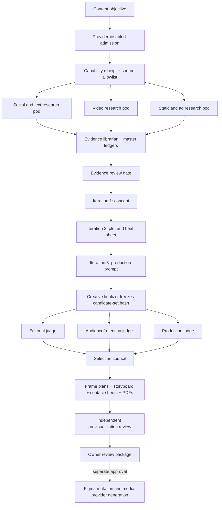

> Current M2 implementation: [two-engine architecture](m2-system-architecture.md) and [operator guide](m2-operator-guide.md). The following phase-one architecture is historical; Instagram Reels is active and YouTube is archive-only.

# Architecture

Status: provider-disabled design contract  
Primary execution controller: LangGraph-compatible state machine  
Primary local operator and integrator: Codex  
Role contracts: hierarchical general agents and bounded sub-agents  
Retrieval: allowlisted lexical retrieval first; LlamaIndex and Graphify only on bounded local corpora

## Product boundary

The Content Engine turns a bounded content objective into an evidence-backed previsualization package. It is not currently a publisher, social-network automation bot, final video generator, or production analytics service.

The first useful product slice is:

`objective -> capability receipt -> bounded research -> normalized material ledger -> segmented analysis -> claim map -> creative iterations -> selected concepts -> frame-by-frame plans -> local storyboard frames -> contact sheets -> PDF reports -> owner review`

Future, separately approved production continues:

`owner generation approval -> image/video/screen/audio lanes -> OpenMontage-compatible timeline -> QA -> Figma/final export -> publication approval -> read-only analytics -> reviewed knowledge promotion`

For owner-approved existing video, the local hybrid editing route is now explicit:

`ffprobe -> Codex/AI timecoded analysis -> reviewed JSON EDL -> FFmpeg deterministic render -> optional OTIO -> optional Resolve human finishing`

The JSON EDL remains the execution authority. Generative repair is an exceptional, separately approved shot lane and is disabled by default.

## Control plane

LangGraph (or an equivalent deterministic local state controller) owns state, transitions, fan-out/fan-in, approval interrupts, retry ceilings, artifact lineage, and terminal status. Agent names are role/task contracts; they do not create authority. Codex remains the local executor and integrator.

Every case has one `ContentCase` state record and one artifact graph. Every transition must name its input hashes and output IDs. An agent cannot approve its own output. Three repair attempts are the maximum, and the same failure twice stops the lane for diagnosis.

## Canonical states

1. `intake.draft`
2. `admission.validated`
3. `sources.allowlisted`
4. `research.capabilities_checked`
5. `research.collecting`
6. `research.materials_normalized`
7. `research.segmented_analysis_ready`
8. `research.evidence_review_gate`
9. `creative.iteration_1_concept`
10. `creative.iteration_2_story`
11. `creative.iteration_3_prompt`
12. `creative.finalization_gate`
13. `selection.three_judge_council`
14. `selection.owner_scope_gate`
15. `previsualization.frame_planning`
16. `previsualization.storyboard_generation`
17. `previsualization.contact_sheet`
18. `previsualization.pdf_report`
19. `previsualization.independent_review`
20. `delivery.owner_review_ready`
21. `figma.approval_interrupt`
22. `generation.approval_interrupt`
23. future parallel states: `generation.stills`, `generation.video`, `capture.screen`, `generation.voice`, `generation.music`, `generation.sfx`
24. `editing.openmontage_timeline`
25. `qa.media_review`
26. `publication.approval_interrupt`
27. `analytics.read_only`
28. `knowledge.promotion_gate`
29. terminal: `complete`, `blocked`, or `cancelled`

No state may jump from a prompt to provider generation, from a local contact sheet to Figma mutation, or from an export to publication.

## Core durable objects

### `ContentCase`

One objective, audience, content pillar, channel set, evidence bundle, candidate set, frame sequences, approvals, reviews, and artifact graph.

### `SourceRecord`

Canonical source URL, platform, author/account class, discovery route, observed date, publication date, rights status, accessibility, collection method, checksum where applicable, and source state.

### `MaterialRecord`

One video, image, carousel, ad, thread, post, article, publication, or landing page. It links to its source, normalized text/transcript, analysis IDs, rights state, and derived inspirations. A reference does not authorize copying or downloading.

### `EvidenceCard`

One factual or observational claim with direct evidence parents, temporal class, confidence, contradiction state, channel limits, and allowed downstream uses.

### `VideoAnalysis`

Semantic transcript, hook, promise, proof, plot beats, scene/shot/timecode map, visual layers, speaking/on-screen text, edit grammar, pacing, audio roles, CTA, inferred audience job, originality constraints, and usable abstractions.

### `StaticAnalysis`

Format, composition, reading order, layout grid, typography roles, asset layers, visual hierarchy, color, proof unit, CTA, accessibility, and frame extraction or regeneration plan.

### `CreativeCandidate`

Evidence-backed concept, plot, three prompt versions, captions, platform variants, originality constraints, feasibility plan, and immutable candidate hash.

### `FrameSequence`

At least 16 seconds of timecoded frames or shots. Each frame specifies narration, spoken text, on-screen text, base visual, human/talking-head layer, overlay layer, transition, motion intent, source/rights state, generation prompt, and acceptance criteria.

### `DeliveryPackage`

One contact-sheet image, individual editable frames, one PDF report, captions, alt text, source ledger subset, rights notes, generation plan, Figma destination plan, and review verdict for one content item.

## Research-to-knowledge path

Use the ArchFlow Block 1 pattern:

`ResearchInput -> StructuredContext -> ResearchBrief/PRD -> ResearchTask + Responsibility -> EvidenceCard -> KnowledgeCandidate -> independent knowledge promotion gate`

Raw links, transcripts, screenshots, prompts, and analytics never become durable memory wholesale. Only small independently reviewed conclusions may update `knowledge/memory.md` or `knowledge/insights.md`.

## Storage and data zones

- `config/`: public-safe configuration and capability receipts.
- `research/`: run-local public research and normalized text. No credentials or private exports.
- `knowledge/`: reviewed reusable context and hypotheses.
- `outputs/`: generated local previews and reports. Generated binaries are ignored until reviewed.
- `private-media/`: ignored and absent by default. It requires a separate consent/data decision.
- `runs/`: admissions, task contracts, checks, receipts, reviews, and handoffs.

Use content hashes and stable IDs. Store paths relative to this project. Never record browser cookies, API tokens, private URLs, account IDs, customer data, or raw personal-media datasets.

## Retrieval and structural analysis

Lexical search is the default. LlamaIndex may add source-addressable retrieval over an explicit manifest containing only approved local files. It must preserve source paths and expose lexical fallback.

Graphify may generate structural reference for this project's docs, schemas, configs, knowledge, and run artifacts. Output belongs under `graphify-out/` and is generated reference, not human synthesis. Broad ArchFlow, Documents, home-folder, social-download, or private-media ingestion is forbidden.

“Leno AI” is not treated as a known dependency. If the owner meant a specific product, record `GAP: exact product/runtime not identified` and ask before installation or architectural reliance.

## Failure and debugging contract

Use correlation IDs and structured masked logs. Error classes include:

- `ADMISSION_FAILED`
- `CAPABILITY_UNAVAILABLE`
- `SOURCE_NOT_ALLOWED`
- `SOURCE_UNREACHABLE`
- `SOURCE_STALE`
- `RIGHTS_UNCLEAR`
- `EVIDENCE_INSUFFICIENT`
- `CONTENT_SIMILARITY_RISK`
- `FRAME_SEQUENCE_INVALID`
- `FIGMA_IDENTITY_MISMATCH`
- `FIGMA_MUTATION_NOT_APPROVED`
- `PROVIDER_AUTH_REQUIRED`
- `BUDGET_EXCEEDED`
- `CONSENT_MISSING`
- `ARTIFACT_CORRUPT`
- `REVIEW_BLOCKED`

Debug in this order: reproduce from immutable case state; identify the failing layer; verify source/inputs/hashes; verify adapter mapping against current official documentation; repair only the smallest stage; rerun focused validation; rerun the provider-disabled fixture; obtain independent review for architectural, rights, identity, provider, or external-action changes.
