# North Hux Content Engine — full system blueprint

## Outcome

The Content Engine is a local-first, evidence-bound path from public market research to original short-form production plans for two product-manager creators. It does not turn competitor media into production assets. It turns observed patterns into reviewed decisions, original scripts, owned proof surfaces, creator recording instructions, and a gated edit timeline.

The current YouTube run freezes 10,000 public videos from 1,010 creators. That is a broad screen, not 10,000 qualified competitors. Strategic distributions use the 2,949 deterministic analysis-eligible videos. Transcript, frame, comment, and native-Short evidence each retain their own denominator.

## Canonical flow

```mermaid
flowchart LR
    B[Research brief and source rights] --> C[Public platform adapters]
    C --> R[Raw immutable observations]
    R --> N[Normalized transcript and frame attempts]
    N --> A[Market analysis bundle]
    A --> O[AI opportunity audit]
    O --> S[Two-track strategy release]
    S --> P[Ten versioned script packages]
    P --> H[Shot plans: creator, proof UI, optional AI context]
    H --> E[Validated EDL / Studio handoff]
    E --> M[Owner media and approval gates]
    M --> Q[Rough-cut QA]
    Q --> U[Separately approved publication]
    U --> Y[Owned analytics and learning]

    R -. hashes and pointers .-> D[(PostgreSQL)]
    N -. transcript segments and frames .-> D
    A -. classifications and review state .-> D
    P -. script versions .-> D
    H -. shot and evidence roles .-> D
    E -. EDL and approvals .-> D
    D -. aggregate projection .-> T[Notion dashboard]
    D -. reviewed synthesis only .-> K[Obsidian / WikiLLM]
```



## Engines and deep interfaces

| Engine | Responsibility | Input | Output | Non-negotiable gate |
|---|---|---|---|---|
| Research | Define audience, queries, channels, strata, rights, and stop conditions | Owner scope and public-source policy | `ResearchBrief`, task contracts, source allowlist | No login/cookies/private access without exact approval |
| Collection | Discover accounts/content and record public observations | Approved platform adapter | Raw objects, request receipts, metrics, comments, media pointers | Public route and terms receipt |
| Evidence | Normalize transcript/frame layers without destroying originals | Raw observations | `EvidenceObservation`, typed gaps, hashes | Missing is never zero; attempts are append-only |
| Market analysis | Code topic, format, hook, story, CTA, audience activity, and reference value | Evidence bundle | `AnalysisBundle`, aggregates, top references | Effective denominator and independent review |
| Opportunity analysis | Start from business work rather than an AI tool | Market analysis + ArchFlow workflow context | Augment / automate / no-action recommendation | Value, feasibility, data, risk, adoption |
| Strategy | Choose audience, position, pillars, franchises, and two creator tracks | Reviewed analysis | Versioned `StrategyRelease` | Maker/reviewer separation and owner review |
| Script | Produce original scripts and claim maps | Approved strategy | Exactly ten `ScriptPackage` candidates in the current slate | No copied transcript; factual claims need evidence or hypothesis labels |
| Shot planning | Convert spoken beats into creator footage, owned proof, context, and transitions | Script package | `ShotPlan`, individual frame files, contact index | AI B-roll cannot be proof or likeness |
| Studio / EDL | Assemble a validated timeline and media requirements | Approved shots | `EditDecisionList`, rough-cut instructions | Owner media, provider, Resolve, and publication gates remain separate |
| Learning | Read owned post-publication analytics | Published content and owned analytics | Experiment results and strategy supersession | No causal claim from competitor public metrics |

Every engine exchanges an `ArtifactEnvelope`: stable artifact ID; run/content identity; type and schema version; project-relative URI; SHA-256; upstream hashes; tool/version; epistemic and rights state; maker/reviewer; review/public-safety state; and supersession edge. Migrations `007` and `008` implement the strategy/Studio and shared-lineage seams.

## Two creator tracks

### Creator A — PM / Integration

Promise: turn business work into bounded AI opportunities and practical integration decisions.

Primary franchises: Workflow Autopsy, Agency Ladder, PM Writes the Agent Contract, ROI Without Fantasy Math, and Human Queue Clinic.

### Creator B — Governed Agent Operations

Promise: show how authority, evidence, state, evaluation, and recovery make agents dependable.

Primary franchises: Failure Lab, Proof Before Scale, permission teardown, release gate, and knowledge/state architecture.

The shared position is the missing operating layer between an AI demo and a dependable business workflow:

`diagnose work → choose operating mode → define authority → integrate evidence → evaluate → recover → prove value`.

## Studio visual grammar

Each current 30-second package has ten continuous shots:

- 12 seconds / 40% original creator A-roll;
- 12 seconds / 40% deterministic owned UI, diagrams, and evidence;
- 2 seconds / 6.7% optional AI-generated metaphorical context; and
- 4 seconds / 13.3% deterministic end card.

Proof appears by 8–11 seconds. AI B-roll is never evidence, UI, a chart, a result, a person, or a likeness. The optional slot can always be replaced by an original creator insert, so provider generation is not on the critical path.

## Canonical truth and projections

- Run-local raw and normalized files are the immutable evidence byte layer.
- PostgreSQL is the canonical structured registry, lineage, analysis, strategy, script, shot, and EDL layer.
- Notion is an owner-facing aggregate and task projection.
- Obsidian/WikiLLM stores reviewed synthesis, decisions, gates, and durable handoffs—not the raw corpus.
- GitHub distributes public-safe code, schemas, migrations, tests, docs, and small fixtures—not a database or raw evidence backup.

## Current limitations

- The 10K evidence collector can be complete only when transcript and frame manifests each resolve every admitted video to `observed` or a typed gap.
- Native Shorts placement is not proved by duration metadata.
- Comments currently come from the bounded 300-account calibration, not the entire 10K set.
- Public YouTube does not expose reliable shares, sends, saves, retention, impressions, conversion, or viewer demographics through the admitted route.
- Instagram and TikTok adapters remain separately gated; this blueprint preserves their future interface but does not claim their data is collected.
- Provider generation, creator likeness, Figma/Resolve mutation, publication, and deployment are not authorized by a research run.

## Primary operator commands

```bash
python3 scripts/analyze_youtube_census_10k.py \
  --run-dir runs/20260826-youtube-video-census-10k-v1 \
  --source-run-dir runs/20260825-youtube-calibration-300-v1

python3 scripts/build_north_hux_campaign_10.py \
  --evidence-summary runs/20260826-youtube-video-census-10k-v1/derived/analysis-summary-10k.json \
  --output-dir outputs/video-plans/north-hux-youtube-10-v1

python3 scripts/load_youtube_census_10k.py \
  --run-dir runs/20260826-youtube-video-census-10k-v1 \
  --campaign-dir outputs/video-plans/north-hux-youtube-10-v1
```

Run the final loader without `--allow-partial`. If it refuses, the evidence stage is not complete.
