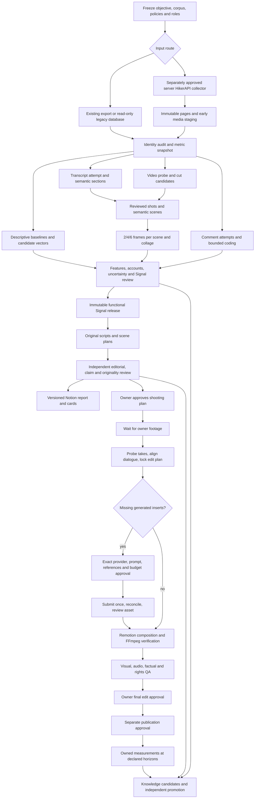

# M2Lab Signal and Studio operating architecture

Version 1 · 2026-09-05 · implementation with explicit evidence limits

This is the current two-engine contract. Instagram Reels is the active research platform. The earlier North Hux YouTube design and its frozen runs are archive-only. The September 4 foundation remains immutable; this implementation is a new release.

## Product and execution boundary

**Signal** turns declared Instagram observations into a reproducible audit, descriptive metric vectors, reviewed text/scene/comment evidence and a scoped decision release. **Studio** uses reviewed functional principles plus the M2Lab brand pack to produce original scripts, scene plans and shooting cards. After owner footage arrives, Studio probes and aligns the takes, plans missing inserts, generates only approved assets and assembles them with Remotion. Publishing is a separate explicit action.

The product is useful at each stopping point. A sparse research release can support clearly labeled editorial hypotheses; it cannot certify a final Best Reel, causality, audience geography or a business result. An editorially accepted shooting card does not mean that its demos are proven, footage exists, generative assets are paid for, or publication is authorized.

## Authority and storage

| Layer | Authority | Contents |
|---|---|---|
| Git repositories | Versioned executable implementation | Modules, schemas, tests, public-safe methods, pinned dependency lock and operator guide |
| Run inputs | Immutable observed source release | Exact supplied source files, provenance and hashes; private/ignored |
| Signal SQLite | Portable normalized release registry | Append-only source observations, release joins, audits, attempts, metrics and decision candidates |
| Controller SQLite | Workflow state | Frozen config, explicit stage states, leases, actor assignments, approvals and hash-linked events |
| Run objects | Evidence and derived assets | Text, probe receipts, scene maps, frames, collages, script candidates, tests and reviews |
| Notion | Human review projection | Dated snapshot tables, graphs, cards and owner decisions; never analytical authority |
| Project knowledge / WikiLLM / Obsidian | Curated reviewed context | Positioning, methods, corrections, decisions, limitations and continuation routing |

SQLite is the no-service baseline for one operator or a serialized server worker. Its backup/restore receipt is required before making durability claims. Previous PostgreSQL tables remain legacy evidence; this release does not silently move their authority or claim a PostgreSQL migration ran. A future multi-writer PostgreSQL deployment needs tested migrations, role isolation and a restore rehearsal. One process owns a ledger at a time; stage concurrency is useful only across independent immutable inputs and disjoint outputs.

## Workflow state and recovery

`m2_orchestrator/policy.py` is the explicit dependency DAG. `m2_orchestrator/state.py` uses transactional SQLite checkpoints and hash-linked append-only events. This preserves the useful ArchFlow/LangGraph practices without requiring a hosted controller or a model invocation for every deterministic step. LangGraph can call the same handlers and persist the same product IDs; it must not introduce a second authority for approvals or mutable outcomes.

State dimensions remain separate:

- observation: observed, partial, empty-unverified, unavailable, not attempted, rights blocked or failed;
- eligibility: pass, fail, unknown or not applicable;
- review: not reviewed, maker complete, pending, approved with scope, changes requested or rejected;
- release: draft, candidate, accepted, rejected or superseded;
- production: not run, planned, generated, edited, owner approved, published or measured;
- stage: not started, running, pass, pass with limitations, fail, blocked by evidence or owner, skipped disabled.

A run freezes source files, configuration, policy, and an explicit implementation manifest including Python, SQL, provider catalog, Remotion source and lockfile, roles and bounded knowledge. Changed inputs, code, configuration or policy require a new run; they never overwrite an accepted release. An unchanged completed stage returns its cached receipt after rechecking the stage and all transitive ancestor artifact hashes. Each start acquires a lease and unique worker token. An expired worker must be explicitly recovered; its old token cannot commit. Failures are typed and sanitized. Three attempts are the ceiling; two identical consecutive errors stop for diagnosis. A paid timeout is an uncertain job needing reconciliation, not permission to submit again.

Review stages require a distinct actor and a structured review binding the exact parent receipt hashes, run/config, scope, verdict and limitations. Local identity strings and hashes are integrity/coordination controls, not cryptographic authentication. A shared server must bind the roster to authenticated operator accounts and protect its state directory. Arbitrary stage receipts are not a substitute for media, quantitative or independent semantic review.

The existing-corpus entrypoint executes actual deterministic work and exports unresolved role tasks. A server timer invokes the same entrypoint from a pinned checkout and exits on failure. It does not pull Git, install packages, renew credentials, invoke an unbounded agent shell or delete logs during a run. Human/agent stages are explicit resumable tasks; no claim is made that a Codex subscription supplies an unattended free model API.

## Research method

Keep provider-native counters separate. `reshares`, sends, shares and reposts are not interchangeable without a provider definition. Null is unknown; zero is an observed value. Numeric conflicts and impossible observations are quarantined before metrics. A captured date is not an exact capture time or a matched exposure horizon.

The implemented descriptive contract is `m2_signal/metrics.py`: minimum five baseline Reels; exposure floor `max(1000, 0.30 × account median views)`; observed action rates per 1,000 views; robust-z with MAD floors and clipping at ±5; a component vector and a transparent diagnostic mean; a two-times-own-snapshot-median hit diagnostic with Wilson interval. The focal Reel remains in this snapshot baseline. These choices reproduce the accepted diagnostic release, not an out-of-sample probability or causal effect. Custom thresholds are validated; unknown parameters fail. No universal score becomes a final Best decision.

Future longitudinal decisions require prior-only frozen baselines, exact observation timestamps, declared age bands, repeated snapshots, creator contribution limits and sufficient matched peer cells. Feature comparisons require reviewed labels, creator-clustered uncertainty, negative/counterexamples and small-cell suppression. Pending source semantics or horizon evidence cannot be fixed by adding decimal places.

Transcript processing preserves source/audio/model/segment/word hashes and timestamps where observed. Separate hook/body/ending by function, with problem-led versus tool-led openings and explicit proof/CTA coding. Text that says a demonstration happened is not visual demonstration proof. ASR output is unreviewed until checked against audio; nonempty output alone does not establish speech.

Cut candidates are technical events. Shots describe continuous views. Semantic scenes describe a stable task, subject or story function and can span cuts. Transcript goal/topic changes, visual/OCR changes and audio events propose boundaries; a scene analyst reviews them. Frames are sampled from actual decoded timestamps within half-open scene intervals. Use 2/4/6 frames based on scene duration/change, at most 48 per video, with hashes, a scene collage and a whole-video index. Missing media means missing frames, not synthetic evidence. A source contact sheet is private analysis; a generated storyboard is a plan and must be labeled separately.

## Studio and production

The M2Lab lens is task → process map → bounded AI role → human review → small test. Public content is English. Radar, Builds and Teardowns explain practical adoption to small-business operators who own the problem but are not specialist AI engineers. Europe is an initial commercial hypothesis, not an inferred creator or audience location. Internal demos are experiments with synthetic data until measured outcomes exist. Do not promise revenue, savings or customer results without evidence.

Every card needs three hooks, one frozen script, timed scenes/shots, spoken words, editable on-screen text, A-roll/B-roll/split-screen composition, proof/demo needs, generated inserts, asset/voice/music/caption plans, claim and source maps, exclusions, review and owner state. At least one slate concept should synthesize the corpus and brand method rather than adapt a single reference. Reference techniques may be reused; distinctive creator wording, identity, music and imagery require separate rights. No competitor material is silently placed in the final edit.

Remotion owns deterministic composition: exact frame timing, layered owner footage, demonstrations, charts, captions and split-screen placement. FFmpeg/ffprobe own media probing, decoding, verification and simple normalization. Generated video fills only the missing shot need. UI, figures and small text stay deterministic. Start/end keyframes, subject/prop/camera continuity, aspect, duration, prompt restrictions and cost ceiling are separate job parameters.

Provider routing is per capability and approved shot. The provider catalog records dated documentation, exact model identifier, duration/resolution/reference support and readiness. A model marketing page proves availability claims, not account entitlement, API reliability or acceptable output. The activation packet binds model, prompt, reference hashes, data/rights, dollar ceiling, retry/poll budget and deterministic fallback. Credentials stay in server-side environment/keychain. See the Studio provider reference for the current official evidence and fixture/live distinction.

## Projection and learning

Notion writes start with MCP schema discovery and exact target readback. Stage a versioned shadow package, inspect conflicts and preserve owner fields such as Status, Lead, Priority and notes. Match stable Reel identities; display mismatched dates and releases explicitly. Idempotency uses release/projection/object identity; uncertain writes are reconciled before retry. Read back all projected values and record partial batches as incomplete. Native charts show descriptive distributions and coverage, never causal proof. A Notion page's availability does not prove its claims.

Knowledge promotion follows source → claim → scope → reviewer → freshness → contradiction → acceptance → receipt. Raw transcripts, source footage, account IDs, private URLs and volatile row metrics stay run-local. Repo knowledge is the portable brain; external vault notes are curated projections with wikilinks and a current index. LlamaIndex/vector storage remains disabled until a bounded benchmark improves the lexical baseline without provenance, privacy or freshness regressions.

## Next execution boundaries

1. Use the tested existing-export run and independent review for current descriptive analysis.
2. Provide an approved existing media cache/export mapping to populate missing transcripts and actual source scenes; HikerAPI remains off locally.
3. Review the proposed scripts and record the desired presenter and shooting choice in Notion.
4. Upload the chosen owner takes through an approved local media map; resume at probe/alignment/edit planning.
5. Approve one exact generative shot/provider/budget and perform a measured pilot before broader paid generation.
6. Integrate the pinned fork on the partner server, restore-test its database and perform a separately authorized one-account live collector pilot before resuming scheduled collection.
7. Review final exports, then separately authorize publishing and define owned analytics horizons.

Each boundary has a recorded state; unfinished external proof must never be reported as a working production service.

Current provider capability sources, alternatives, free-infrastructure boundaries and the required live comparison are recorded in [the dated provider assessment](m2-provider-assessment.md). Public capability documentation and local payload tests do not establish paid model quality.
