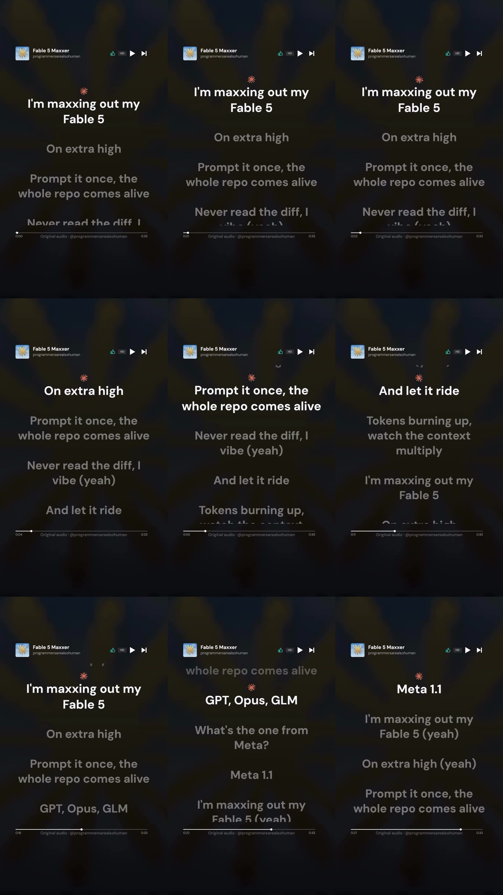
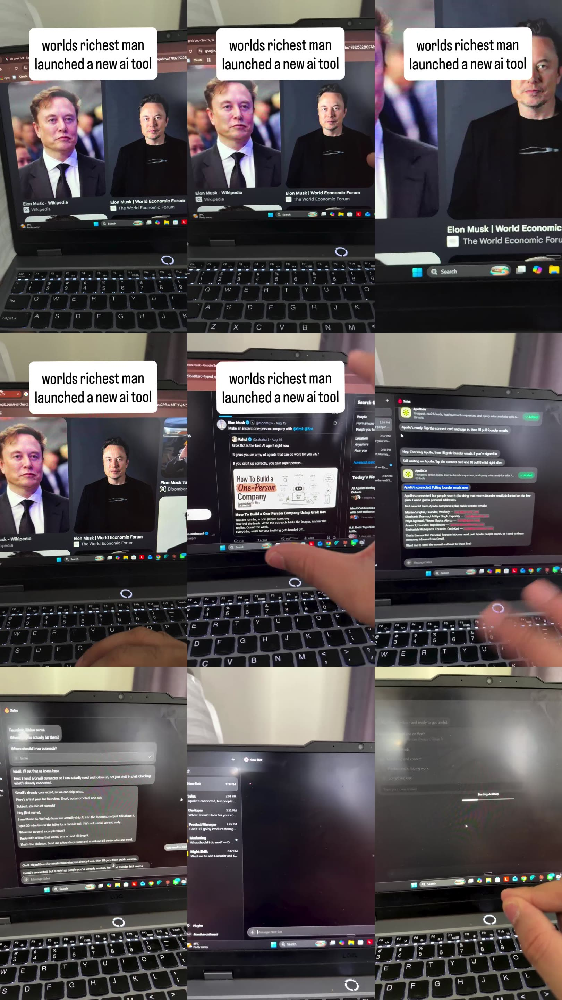
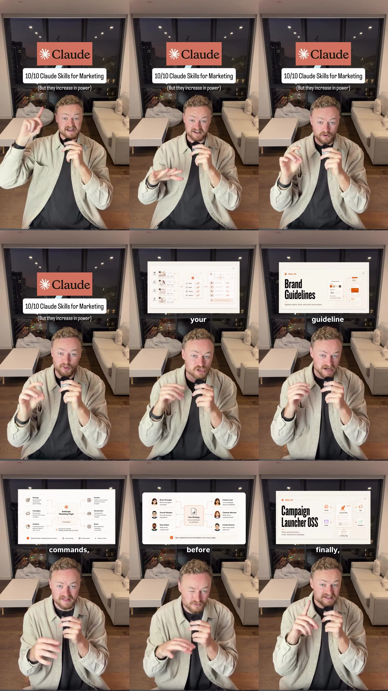
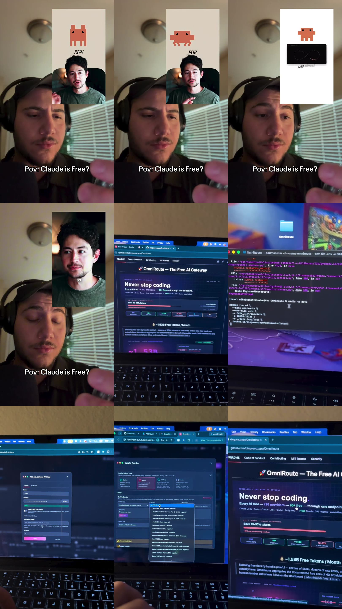
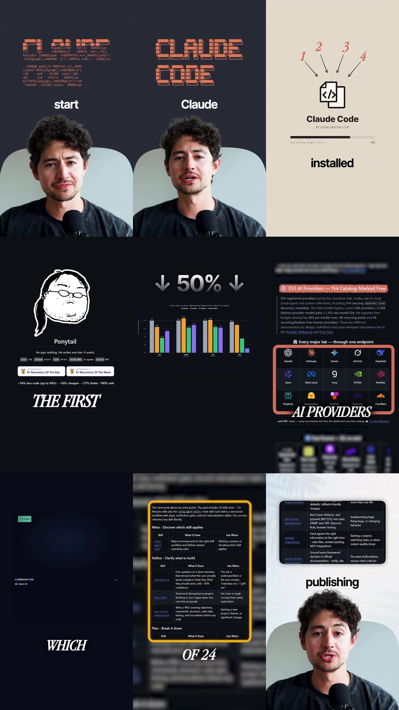

# Run of 7 September 2026 — what the radar proposed

First fully automatic run: started by cron at 07:00, finished 08:18, cost $2.12.
Collection, scoring, frame analysis, transcription, topic tagging and card selection all
ran unattended; the agent then read the frames and transcripts and wrote the angles.

The Notion export failed at the end — our three databases had been archived, so the
cards never reached the workspace. This file is that missing output.

---

## What the run collected

| | |
|---|---|
| Accounts pulled | 106 |
| Reels collected | 1 260 |
| Scored | 1 255, of which 1 156 passed the entry gate |
| Analysed frame by frame | 97 — **every video link was still alive** |
| Cards proposed | 9 |
| Cards the agent struck out | 4, with a reason for each |
| Cost | $2.12 |

The live links matter: the previous attempt downloaded zero of a hundred because the
analysis ran two days after collection and Instagram CDN links expire in hours. Putting
analysis inside the same run fixed it.

---

## The five cards

### 1. M2 Radar — reference @leadgenman

**We wrote the rule ourselves, and for two days our own code ignored it — because nobody read the diff.**

**Our angle.** The line everyone shared is the joke: "never read the diff, I vibe." We take it literally and move the subject off the token bill, where the reference leaves it, onto the step that actually failed for us — review. What we have that the author does not: a run where this happened on our own tool. We wrote a rule in our own documents and our code did not enforce it for two days; nobody, us included, read the diff that would have shown it. Same run, the ranker put a 654-view reel above a 25 000-view one — again visible in the output, not in the bill. So our position: on high settings the model is not the risk, the unread diff is, and the fix is a review step somebody actually runs, not a bigger context window. We show the two days on screen. We make no claim about anyone else's spend.

| Reference | Value |
|---|---|
| Reel | https://instagram.com/reel/DcvBtiNtbYO |
| Views | 77 261 · 3.5× this author's own median |
| Score | 2.15 |
| Shares / 1k | 60 · Saves / 1k 7 |
| Length | 33s · 0.00 cuts per second |
| Transcript | 66 words |
| Topics | Токены, стоимость, лимиты |

**How we shoot it**

| Column | What goes there |
|---|---|
| In frame | one static shot, presenter fully in frame |
| On screen | full-frame insert: before and after, one number |
| In the banner | a number in the banner, held for the whole reel |

**Caption frame.** sharpen for the query: Токены, стоимость, лимиты · must contain: process, cost, what changed · first line: written as a search query

### 2. M2 Radar — reference @manthanjethwani

**An agent that is wrong looks exactly like an agent that is right: ours ranked a 654-view reel above a 25 000-view one.**

**Our angle.** The reference sells an org chart — sales, developer, PM, marketing, night shift — and never once shows an agent being wrong. We do not take its framing: "start a company without hiring" is the money-from-AI niche, not ours. We take one seat, the sales one, and ask the only question an operator has: does checking the agent's output take less time than doing the work yourself? What we have that the author does not is an agent pipeline that ran on real data and got it confidently wrong — our own ranker put a 654-view reel above a 25 000-view one, and a free source it depended on closed mid-run and left it producing nothing. An AI employee is not free labour, it is a new review job that lands on someone's Monday. We say plainly on camera that we have not run an AI sales seat inside a client process, so we show ours instead — the run, the wrong pick, and what we put in to catch it.

| Reference | Value |
|---|---|
| Reel | https://instagram.com/reel/DcvX-lDAhk_ |
| Views | 108 299 · 3.8× this author's own median |
| Score | 2.04 |
| Shares / 1k | 39 · Saves / 1k 35 |
| Length | 59s · 0.07 cuts per second |
| Transcript | 217 words |
| Topics | Новости моделей и лабораторий |

**How we shoot it**

| Column | What goes there |
|---|---|
| In frame | one static shot, presenter fully in frame |
| On screen | full-frame insert: before and after, one number |
| In the banner | a number in the banner, held for the whole reel |

**Caption frame.** sharpen for the query: Новости моделей и лабораторий · must contain: process, cost, what changed · first line: written as a search query

### 4. M2 Builds — reference @nocode.joshua

**We built the "top creators to content plan" skill: 2 352 reels, $12.46, and one pick that was flatly wrong.**

**Our angle.** Skill number one in his list — "tracks top creators and turns their patterns into your content plan" — is the thing we actually built. We ignore the other nine and build only that one, because it is the only one we can put a real run behind. Ours took two days: 2 352 reels collected, a hundred taken apart frame by frame, 89 transcripts, and $12.46 of model spend across 623 units. The half a listicle can never show is where it breaks, and we have three: the ranker put a 654-view reel above a 25 000-view one; the free profile source closed mid-run; a rule written in our own documents went unenforced by the code for two days. Our position: the build is the cheap half, the judgement is the half you still supply, and a skill that picks for you has to be checkable or it is worse than no skill. On screen: the actual run, the wrong pick, and the check we added after it.

| Reference | Value |
|---|---|
| Reel | https://instagram.com/reel/Dco1mOJzZ4L |
| Views | 26 730 · 3.6× this author's own median |
| Score | 1.53 |
| Shares / 1k | 15 · Saves / 1k 57 |
| Length | 67s · 0.12 cuts per second |
| Transcript | 189 words |
| Topics | Claude Code: скиллы, плагины, команды |

**How we shoot it**

| Column | What goes there |
|---|---|
| In frame | own desk and rig, shot in one take |
| On screen | terminal or interface where the break is visible |
| In the banner | what we built and the step where it broke |

**Caption frame.** sharpen for the query: Claude Code: скиллы, плагины, команды · must contain: process, cost, what changed · first line: written as a search query

### 6. M2 Builds — reference @thetechniko

**Our whole radar — two days of building, 623 units — cost $12.46. The model was never the expensive part.**

**Our angle.** We install it and route a real working run through it, not a hello world — the radar's own collection pass. Our position going in, and we state it before the demo: free routing optimises the cheapest line in the whole process. Building the radar took two days and $12.46 across 623 units; the model was never what hurt. What hurt was a free source that closed mid-run and left the pipeline blind, and video links that die within hours. So the Builds question is not "can you get free tokens" but "what happens to your Monday when the free provider disappears halfway through a run" — we already know the answer, because it happened to us with a different free source. We shoot the fallback firing and, after the run, put the two numbers side by side: what the routing saved and what it cost to make the run reliable again. If the saving turns out to be inside the noise, that is what we say.

| Reference | Value |
|---|---|
| Reel | https://instagram.com/reel/DcU_BdKulGJ |
| Views | 42 317 · 3.2× this author's own median |
| Score | 1.46 |
| Shares / 1k | 15 · Saves / 1k 56 |
| Length | 110s · 0.13 cuts per second |
| Transcript | 336 words |
| Topics | AI-видео и производство контента | Бесплатный доступ и обход платы |

**How we shoot it**

| Column | What goes there |
|---|---|
| In frame | own desk and rig, shot in one take |
| On screen | terminal or interface where the break is visible |
| In the banner | what we built and the step where it broke |

**Caption frame.** sharpen for the query: AI-видео и производство контента · must contain: process, cost, what changed · first line: written as a search query

### 7. M2 Teardown — reference @nick_saraev

**Four plugins promise to cut your token bill. Our token bill for the whole build was $12.46.**

**Our angle.** The topic qualifies because it repeated: the same plugin stack turned up in three separate reels this week, OmniRoute in all three. We do not review the plugins — we take apart the process they claim to fix. Step by step, the week we spent building one small working tool: collect, rank, write, publish, and where the hours and the dollars actually went. Ours: $12.46 across 623 units for the entire build, against a free source that closed mid-run, video links that died within hours, and a rule in our own documents the code did not enforce for two days. Every plugin in that list optimises the $12.46 line. The step where AI had no business deciding for us was the pick: our ranker put a 654-view reel above a 25 000-view one, and that is now a human gate. Forward-worthy because it is the same arithmetic in any small team's week, and the number is ours, not a benchmark. Title and first caption line written as the search query: "what claude code plugins actually save".

| Reference | Value |
|---|---|
| Reel | https://instagram.com/reel/DcwCCgivcIQ |
| Views | 467 459 · 4.1× this author's own median |
| Score | 0.66 |
| Shares / 1k | 13 · Saves / 1k 55 |
| Length | 50s · 0.42 cuts per second |
| Transcript | 196 words |
| Topics | Claude Code: скиллы, плагины, команды | Программирование и код |

**How we shoot it**

| Column | What goes there |
|---|---|
| In frame | the process in frame: phone, laptop, paper |
| On screen | the steps listed one at a time |
| In the banner | the cost figure: what this runs you per week |

**Caption frame.** sharpen for the query: Claude Code: скиллы, плагины, команды · must contain: process, cost, what changed · first line: written as a search query

---

## What the agent struck out, and why

**3. M2 Radar — @damini.knows** (28 018 views, 1.85)  
1.8× this author's own norm (28 018 against 15 178) · 36 shares per thousand · 61 saves per thousand · 0.08 cuts per second · 49 seconds

**5. M2 Builds — @liamjohnston.ai** (161 211 views, 4.85)  
13.5× this author's own norm (161 211 against 11 944) · 24 shares per thousand · 57 saves per thousand · 0.09 cuts per second · 63 seconds

**8. M2 Teardown — @maxjohnscn** (10 553 views, 2.65)  
3.1× this author's own norm (10 553 against 3 436) · 14 shares per thousand · 54 saves per thousand · 0.27 cuts per second · 64 seconds

**9. M2 Teardown — @felixbravoai** (11 914 views, 2.19)  
2.6× this author's own norm (11 914 against 4 517) · 13 shares per thousand · 53 saves per thousand · 0.12 cuts per second · 78 seconds

---

## How to read this

Every card starts from a competitor reel that actually performed against **its own**
author's norm — not against the niche. The angle is the turn: what we have in that topic
that the author does not, and what we can prove. Evidence comes from building the radar
itself — our own bill, our own broken ranker — because that is what we own today.

The four struck-out cards matter as much as the five kept ones: the agent refused them
against `POSITIONING.md`, not at random. Two failed for having no proof we could show,
one duplicated a card already in the slate, one was personal productivity rather than AI
inside a working process.
